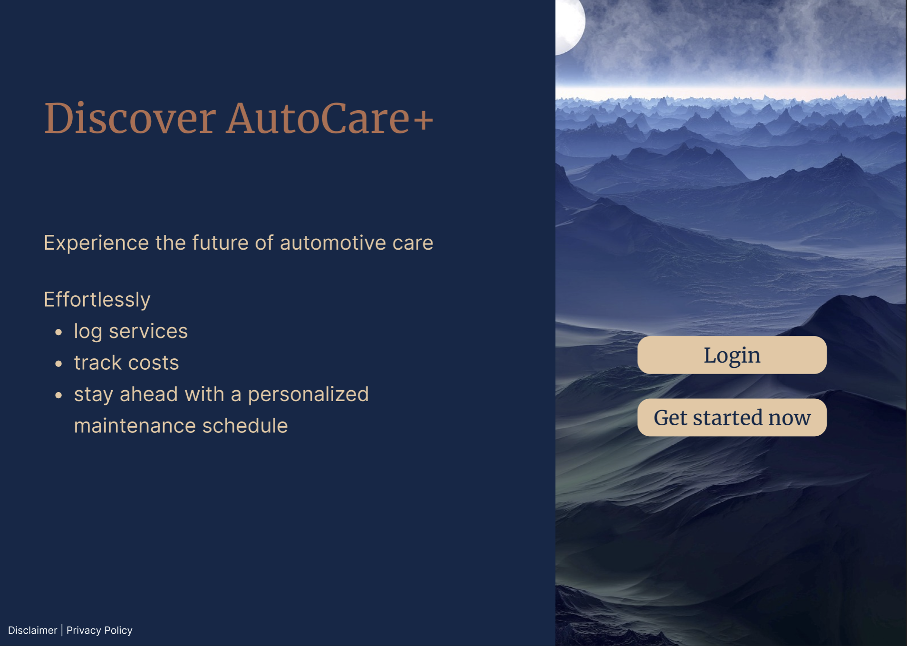
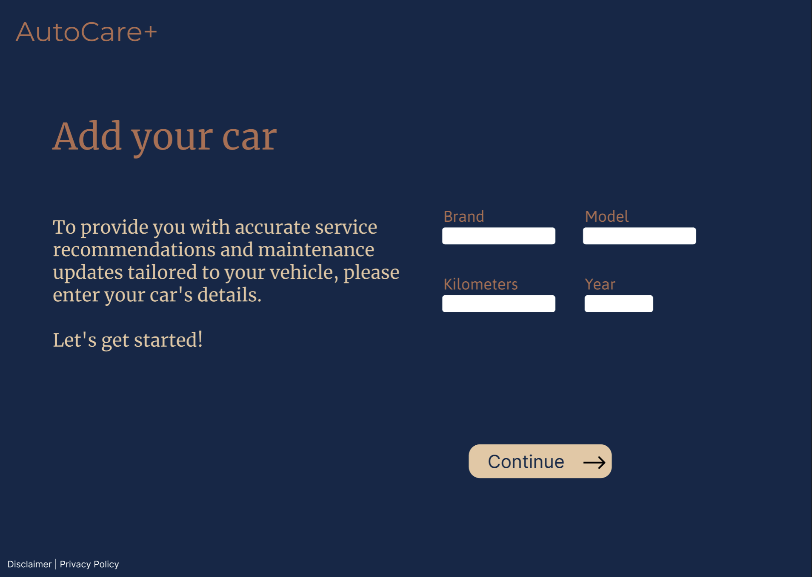
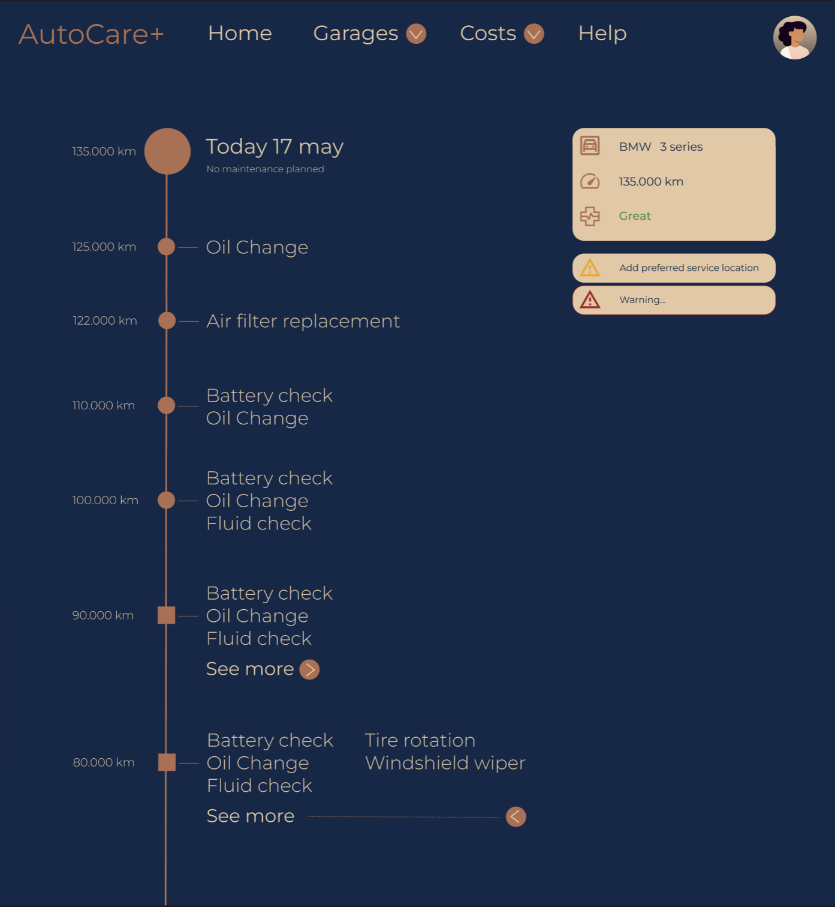
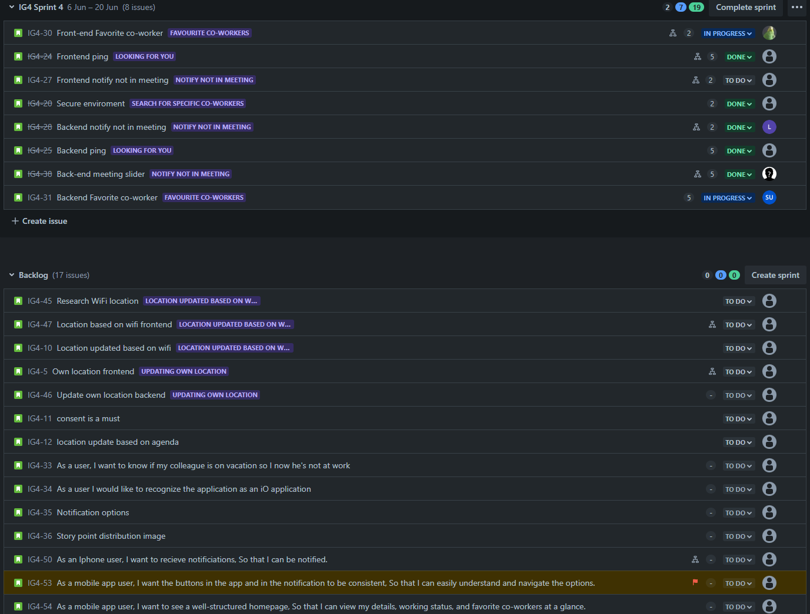
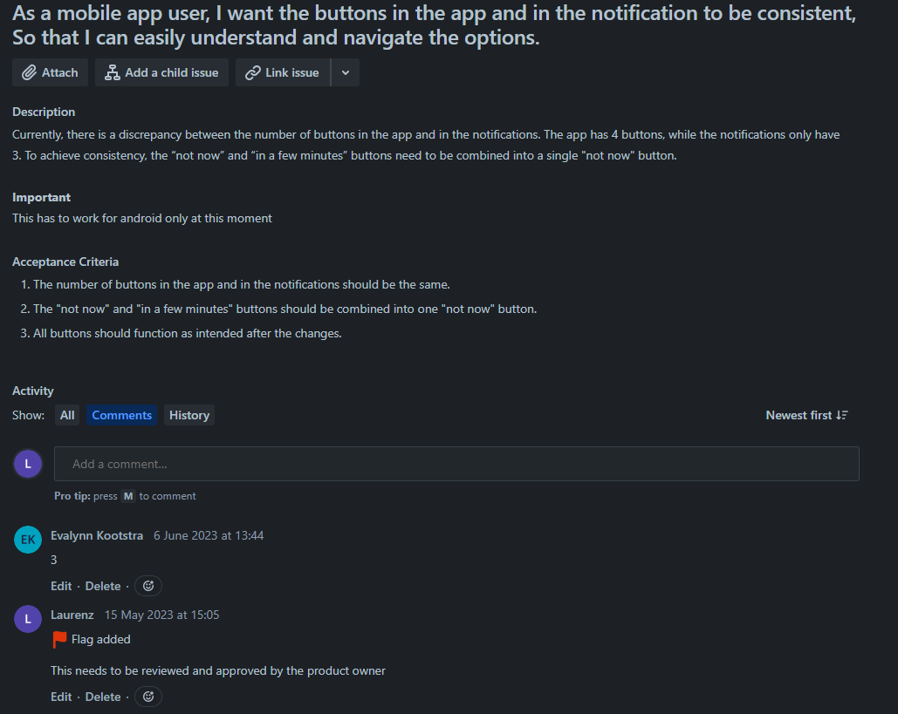
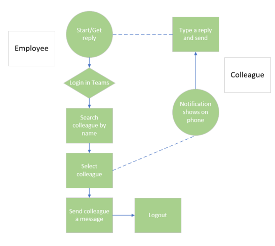

# S3 portfolio

## Table of Contents

- [Introduction](#introduction)
- [Learning Outcomes](#learning-outcomes)
- [Evidence of Learning Outcomes](#evidence-of-learning-outcomes)
- [Research](#research)
- [Conclusion](#conclusion)

## Introduction
In this portfolio I would like to show the different learning outcomes for this semester and afterwards talk about how I proved them. At the end there will be a short conclusion

## Learning outcomes

### Definition of learning outcomes

1. **Web application**
   - Learning outcome:
     - You design and build user-friendly, full-stack web applications.
   - Clarification
     - User friendly: You apply best practices when creating user interfaces and basic user experience testing and development techniques.
     - Full-stack: You design and build a full stack application using a commonly accepted front end Javascript framework and back end application implementing relevant communication protocols, persistence of data by usage of ORM and addressing asynchronous communication issues.
2. **Software Quality**
   - Learning outcome: 
     - You use software tooling and methodology that continuously monitors and improve the software quality during software development.
   - Clarifications:
     - Tooling and methodology: Carry out, monitor and report on unit integration, regression and system tests, with attention for security and performance aspects, as well as applying static code analysis and code reviews.
3. **Agile method**
   - Learning outcome: 
     - You choose and implement the most suitable agile software development method for your software project.
   - Clarifications:
     - Choose: You are aware of the most popular agile methods and their underlying agile principles. Your choice of a method is motivated and based on well-defined selection criteria and context analyses.
4. **CI/CD**
   - Learning outcome: 
     - You design and implement a (semi)automated software release process that matches the needs of the project context.
   - Clarifications:
     - Design and implement: You design a release process and implement a continuous integration and deployment solution (using e.g. Gitlab CI and Docker).
5. **Cultural differences and ethics**
   - Learning outcome:
     - You recognize and take into account cultural differences between project stakeholders and ethical aspects in software development.
   - Clarifications:
     - Recognize: Recognition is based on theoretically substantiated awareness of cultural differences and ethical aspects in software engineering.
     - Take into account: Adapt your communication, working, and behavior styles to reflect project stakeholders from different cultures;
     - Address one of the standard Programming Ethical Guidelines (e.g., ACM Code of Ethics and Professional Conduct) in your work.
6. **Requirements and design**
   - Learning outcome:
     - You analyze (non-functional) requirements, elaborate (architectural) designs and validate them using multiple types of test techniques.
   - Clarifications:
     - Multiple types of test techniques: You apply user acceptance testing and stakeholder feedback to validate the quality of the requirements. You evaluate the quality of the design (e.g., by testing or prototyping) taking into account the formulated quality properties like security and performance.
7. **Business processes**
   - Learning outcome:
     - You analyze and describe simple business processes that are related to your project.
   - Clarifications:
     - Simple: Involving stakeholders, predominantly sequential processes with one or two alternative paths.
     - Related: Business processes during which the software that you are developing will be used (business processes that the software must support by fully or partially automating them).
     - Business processes needed for the success of your software development project (e.g., product release, market release, financial assurance).
8. **Professional**
   - Learning outcome:
     - You act in a professional manner during software development and learning.
   - Clarifications:
     - You develop software as a team effort according to a prescribed software methodology and following team agreements. You are able to track your work progress and communicate your progress with the team.
     - You actively ask and apply feedback from stakeholders and advise them on the most optimal technical and design (architectural) solutions.
     - You choose and substantiate solutions for a given problem.

 

### Evidence of learning outcomes
For each learning outcome, present the relevant piece of work and explain how it demonstrates your proficiency in that particular outcome. Include the feedback from your teachers here.
 
**1. Web application** 

#### What have I used
In this semester I have set up a the beginnings of a full stack web application, using NextJS, restfull .NET 7 API and FaunaDB.
 
#### How does it work

When a visitor first visits the website they get a short introduction to what the application is. The register and login buttons are clearly visible. After they have registered, they are redirected to a screen to add their vehicle. In the future a dashboard feature will be added. I researched how to get the application user-friendly, also I recieved feedback from the people around me. After this I implemented it in the designs. 

All of this is made possible with docker, At the start of the semester I had heard about it but never used it. Now I have made a full stack application reality and I have hosted the API for the group project on AWS.

Also, I have used nginx for routing.

I have dockerfiles in the folders named; [fauna_db_api](https://github.com/CarMaintenanceIPS3/fauna_db_api), [nextjs](https://github.com/CarMaintenanceIPS3/NextJS) and [nginx](https://github.com/CarMaintenanceIPS3/CarMaintenanceDockerSetup/tree/main/nginx). In the zip on the same level as these folders, I have the docker-compose.yml.

 

---

**2. Software Quality** 
#### What have I used
Frontend tools used include Jest, Lint, Axios, SonarCloud, QodeQL, and Dependabot. I also made use of TS instead of JS for better quality.
The backend was developed with XUnit and SonarCloud.
 
#### How does it work
Every push or commit to the master branch triggers a code quality check by SonarCloud. This ensures that there are no code smells, bugs, or other issues in my code before it's deemed safe for production. Additionally, the CI automatically runs tests on the frontend. The clearest representation of my testing is in the frontend, and all tests for it can be found in the folder; nextjs/__ test __ `https://github.com/CarMaintenanceIPS3/NextJS/tree/dev/__tests__`

I want to explain Savevehicle.ts in the test folder. In the file there are two tests named;

1.  **responds with success when given valid data**
This test is for simulating a successful scenario where valid vehicle data is sent to the `saveVehicle.ts` endpoint in the api folder. The expected result is a status code of 200 and a success message from the server.
    
2.  **responds with error when given invalid data**
This test simulates an error scenario where incorrect vehicle data is sent to the same endpoint. I expect the server to return a status code of 500 and an error message.

Mocking the server allows me to control the server responses in a predictable way and makes these tests more reliable and easier to write. This is important for testing how the application handles different server responses, which would be harder to do with a real server.

 

---

**3. Agile method**

Both the group and the individual projects used Agile Scrum. While this methodology was highly effective for the group project, I found some challenges in applying it to the individual project. Nonetheless, images of the board for the group project clearly depict my understanding and proficiency in this area. 

 

---

**4. CI/CD**

For the software release process, I designed and implemented a CI for both the backend and the frontend. To demonstrate my understanding of CD, I added it to my frontend, which now runs the tests and SonarCloud through the CI. Upon successful passing the CI a Docker image is created and stored on Docker Hub, simplifying the deployment on a server. The link to my CI/CD can be found here: https://github.com/CarMaintenanceIPS3/NextJS/tree/dev/.github, or in the project folder under nextjs/.github/workflows/ci.yml.

 

---

**5. Cultural differences and ethics**

During our group project, we considered the ethical implications of our application, which required a login and in the future, location tracking of its users. Login and location tracking should always be secured. This holds very sensitive data. location tracking can tell someone if you are home or not. The login feature falls under ethical since this is personal data. For example, When a user want his/her data deleted then this should be fully deleted.

 To account for cultural differences we encouraged every team member to share and explain their opinions. Our team consisted of one international student and five dutch students.
The main language used is English. All dutch documents where translated.

 

---

**6. Requirements and design**
  
In the group project, we documented the thinking behind our choice of a particular framework or technique. For my individual project, my choices were guided by my personal interests in certain technologies. As a learning experience I have mostly chosen for tools and frameworks that were new to me.
In the group project we have also written a test plan.

All documentation for the group project can be found in the folder GP-S3/General/Documentation

 

---

**7. Business processes**

We have made the business process for the group project. This can be found in the folder GP-S3/General/Documentation

Here is the image of what the process is before implementation of our application.

 

---

**8. Professional**

Throughout the group project we had a sprint delivery every three weeks with our stakeholder. In these meetings we presented our progress and plans for the upcoming sprint. Whenever there was a question during the sprint we, as a group, composed an email to the Product Owner (PO), explaining our choice of certain technologies.

After every sprint, we held a retrospective meeting to provide feedback to each other. We noted a clear improvement in addressing the initial problem areas as the project progressed.

Below you can find an examples of how we advised the PO with the last sprint:

*Following our meeting today, our team has been strategizing the best approach for our last sprint, which comprises three working days. A key decision we need to make is about task prioritization: should we put functionality or design first?*

*Just to clarify, prioritizing one doesn't mean neglecting the other. Rather, it's about determining the order of completion. If a team member finishes their tasks early, we want them to know what the next focus should be. Your thoughts on this would be very helpful.*

*We have the issue that auth0 is not working with Expo Go. We believe that Firebase could be an excellent alternative for the login system, given that it's already in use on our frontend. We would appreciate your input on exploring this option and potentially implementing it, should it prove effective.*

*Regarding the tasks for our next sprint, here are the reasons behind our selection:*

-   *Login: The app can't function without it, so fixing it is a priority.*
-   *Favorite Employee Feature: A significant portion of this feature is already complete, making it logical to include in this sprint.*
-   *Meeting Slider & Notify Not in Meeting: These features are in the sprint for the same reason as the Favorite Employee feature - a lot of progress has already been made on them.*
-   *Frontend Tickets: We want to make the app user-friendly, so these tasks are in the sprint to improve the user experience.*

*Our draft plan is laid out in Jira, and we'd greatly value your feedback on it. We're open to suggestions and are ready to make adjustments as necessary. If you disagree with any part, or if you think we should consider other paths, we're more than willing to discuss and adapt.*

*In an effort to maximize the final sprint, we've decided not to include iOS development. Our concern is that it might introduce complications and consume more time than we can afford at this stage. We want to concentrate on delivering as much value as possible within the given time frame.*

*We look forward to your feedback.*

## Research
This semester we had to write two research reports. I have chosen to write a research report about Designing Secure APIs. With the subquestions;
1.	What are the best practices for designing secure APIs for web applications?
2.	How can access control be implemented for different user roles (e.g., owner, service provider) in the API?
3.	What measures can be taken to protect against common API security threats, such as SQL injection, cross-site scripting, and CSRF attacks?
4.	How can rate limiting and request validation be used to mitigate API abuse and ensure service availability?
5.	How can input validation and output encoding be implemented in the API to prevent injection attacks and data leaks?
6.	How can API versioning be managed to maintain backward compatibility and security updates without disrupting the user experience?

After I told Leon about my choice of research he gave me two options, Scope the research or keep it the same and write one research report. I have chosen for the latter, write one research report.

After working on it for a few weeks I found out that it may be too big but now I was very interested in all the research I had done. In the future I would have scoped this research. Now I also answered questions that are not that relevant for my own project.

The research can be found in [api-security-research](https://github.com/CarMaintenanceIPS3/api-security-research)

## Conclusion
There are a lot of things that I would have done differently and there are also a lot of things still in my to do list for this application. For example, the .env is not all the way set up. Some secrets are in github Secrets, others are in a .env file locally. When someone else wants to work on this then a local .env file doesnt work that great.

Overall, reflecting on my journey this semester, I'm proud of what I've achieved and the skills I've acquired. I have found out how important code quality is in multiple projects that depend on each other. 
The knowledge gained during this semester have set a solid foundation for my continued growth in the field of software development.

When I have to give myself a proficiancy rating, then I would say that I am Proficient.
